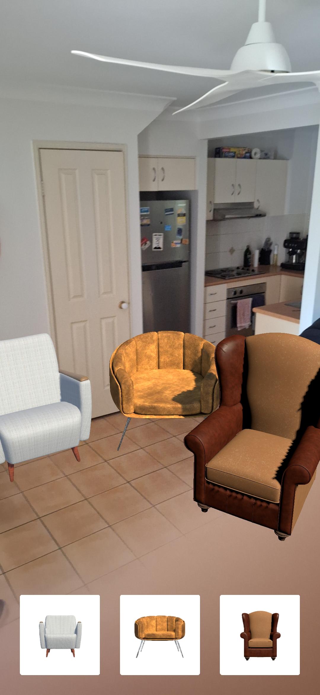

# Augmented Reality Furnishing App

 

 

## Overview

- This repository is the result of following [this tutorial](https://www.youtube.com/watch?v=FJAO6jDYljs) by Freecodecamp regarding making augmented reality applications
- The purpose of this tutorial was the strengthen my Unity skills, as well as my ability to develop applications related to an area that I am interested in, which is extended reality (XR)
- The content of this repository includes code for an augmented reality mobile application that lets the user place furniture into a 3D space

## Video Example

## Screenshot

